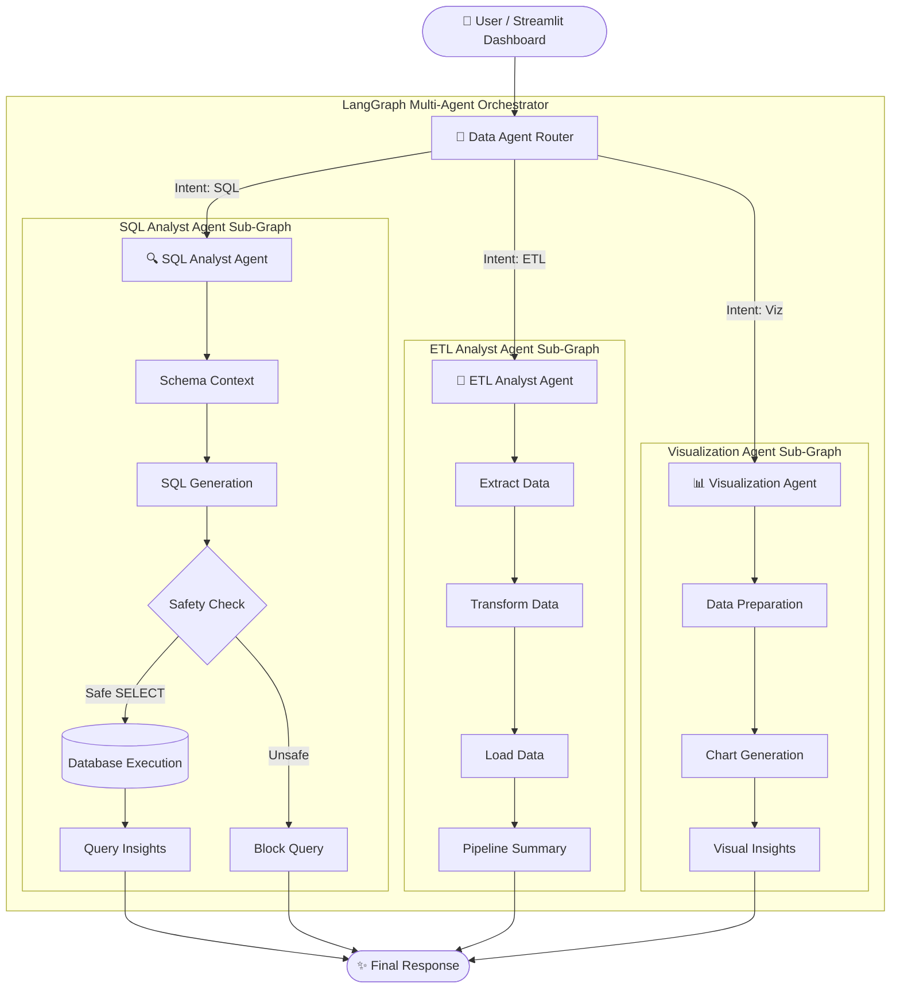

# 🤖 QueryMind AI — Autonomous Multi-Agent Data Analytics & ETL Platform


**QueryMind AI** is an enterprise-ready, autonomous multi-agent platform designed for intelligent data processing, natural language to SQL translation, automated ETL pipeline execution, interactive data visualization, and LLM benchmarking.

Powered by **LangGraph**, **Streamlit**, and **Pydantic**, QueryMind AI routes complex natural language queries to specialized AI sub-agents to deliver safe database querying, automated data transformations, and instant chart insights.

---

## 📋 Table of Contents

- [Overview](#-overview)
- [System Architecture](#-system-architecture)
- [Key Features](#-key-features)
- [Project Structure](#-project-structure)
- [Prerequisites](#-prerequisites)
- [Installation & Setup](#-installation--setup)
- [Running the Application](#-running-the-application)
  - [1. Streamlit Web Dashboard](#1-streamlit-web-dashboard-app_uipy)
  - [2. Command Line Interface](#2-command-line-interface-mainpy)
  - [3. Evaluation Suite](#3-evaluation-suite-evalsrun_evalspy)
- [Agent Ecosystem](#-agent-ecosystem)
- [Data Models & Schemas](#-data-models--schemas)
- [Security & Validation](#-security--validation)
- [Deployment & GitHub Roadmap](#-deployment--github-roadmap)
- [Contributing & License](#-contributing--license)

---

## 🎯 Overview

Modern data engineering and analytics require bridging natural language questions with complex database schemas, Pandas transformations, and visual charts. **QueryMind AI** functions as an intelligent agentic orchestrator that classifies user intent and dispatches tasks to specialized sub-agents:

1. **Data Agent (Router):** Orchestrates workflow state using LangGraph and routes queries based on intent classification.
2. **SQL Analyst Agent:** Converts natural language into schema-aware, safe SQL queries, validates safety, executes against databases, and extracts data insights.
3. **ETL Analyst Agent:** Ingests data from API endpoints and executes automated Pandas extraction, transformation, and load operations with pipeline summaries.
4. **Visualization Agent:** Prepares queried datasets, generates interactive Plotly/Matplotlib charts, and returns visual insights.

---

## 🏗️ System Architecture



---

## ✨ Key Features

- **🧠 Intelligent Query Routing:** Uses LangGraph state graphs to classify user queries into SQL analysis, ETL pipeline operations, or visual reporting.
- **🔒 SQL Safety Guardrails:** Built-in security validator blocks destructive statements (`DROP`, `DELETE`, `UPDATE`, `INSERT`, `ALTER`) and automatically handles SQL query limits.
- **🔄 Automated ETL Operations:** Supports multi-format data ingestion (API, CSV, JSON, Parquet) and Pandas-based data transformations.
- **📊 Dynamic Visual Analytics:** Generates real-time charts and visual summaries directly from queried datasets.
- **⚡ Cost-Aware Multi-LLM Selection:** Dynamically routes low, medium, and high-complexity queries across different models (Groq, OpenAI, Claude).
- **🖥️ Modern Web UI:** Sleek Streamlit dashboard for interactive natural language queries, schema inspection, and data export.
- **🧪 Benchmark & Evaluation Suite:** Includes automated test runners to evaluate agent accuracy, execution latency, and error rates.

---

## 📁 Project Structure

```
YourData_Agent/
├── agents/                          # Specialized AI Agents
│   ├── __init__.py
│   ├── data_agent.py               # Main router & LangGraph orchestrator
│   ├── sql_analyst.py              # Text-to-SQL & query execution agent
│   ├── etl_analyst.py              # API extraction & Pandas ETL agent
│   └── viz_analyst.py              # Data visualization agent
│
├── Models/                          # Pydantic Schemas & State Management
│   ├── __init__.py
│   └── schema.py                   # State schemas (AgentSchema, ETLAgentSchema, etc.)
│
├── utils/                           # Core Utilities & Helper Functions
│   ├── __init__.py
│   ├── database.py                 # DB connection and schema reflection
│   ├── etl_tools.py                # Ingestion, transformation & file toolkits
│   └── llm_pick.py                 # Dynamic LLM provider & complexity router
│
├── evals/                           # Evaluation & Benchmarking Suite
│   └── run_evals.py                # Automated agent testing framework
│
├── docs/                            # Comprehensive Documentation
│   ├── agentic-upgrade/             # Architecture upgrade guides
│   ├── free-stack-migration/        # Stack migration blueprints
│   └── project-understanding/       # In-depth system design breakdown
│
├── audit/                           # Security, Quality & Performance Audits
│   └── final/                       # Production readiness reviews
│
├── data/                            # Datasets & Ingestion Directories
│   ├── extract/                     # Ingested API datasets
│   ├── transform/                   # Transformed output files
│   ├── payments.csv                 # Sample dataset
│   ├── ratings.csv                  # Sample dataset
│   ├── rides.csv                    # Sample dataset
│   ├── users.csv                    # Sample dataset
│   └── vehicles.csv                 # Sample dataset
│
├── app_ui.py                        # Streamlit Web Application Dashboard
├── main.py                          # CLI Execution Entrypoint
├── feed_db.py                       # Database seed and loader script
├── pyproject.toml                   # Project dependencies and metadata
├── requirements.txt                 # Pip requirements manifest
├── toupdate.md                      # 4-Day staged deployment plan
└── README.md                         # Project documentation
```

---

## 📦 Prerequisites

- **Python:** `3.12` or higher
- **Package Manager:** `uv` (recommended) or standard `pip`
- **Database:** SQLite (default) or PostgreSQL
- **LLM API Key:** Groq (Free default), Anthropic Claude, or OpenAI

---

## 🚀 Installation & Setup

### 1. Clone Repository & Setup Virtual Environment

```bash
git clone https://github.com/your-username/QueryMind_AI.git
cd QueryMind_AI

# Create virtual environment
python -m venv .venv

# Activate environment
# Windows (PowerShell):
.\.venv\Scripts\Activate.ps1
# macOS/Linux:
source .venv/bin/activate
```

### 2. Install Dependencies

Using `uv` (faster):
```bash
uv pip install -r requirements.txt
```

Or using standard `pip`:
```bash
pip install -r requirements.txt
```

### 3. Environment Configuration

Create a `.env` file in the root directory:

```env
# Primary LLM Provider (groq | openai | anthropic)
LLM_PROVIDER=groq
GROQ_API_KEY=your_groq_api_key_here

# Groq Model Routing
GROQ_MODEL_LOW=llama-3.1-8b-instant
GROQ_MODEL_MEDIUM=llama-3.3-70b-versatile
GROQ_MODEL_HIGH=llama-3.3-70b-versatile

# Database Credentials (If using PostgreSQL)
DB_HOST=localhost
DB_PORT=5432
DB_USER=postgres
DB_PASSWORD=your_password
DB_NAME=postgres
```

---

## 💻 Running the Application

### 1. Streamlit Web Dashboard (`app_ui.py`)
Launch the interactive web interface:

```bash
streamlit run app_ui.py
```
Open your browser at `http://localhost:8501` to query your data in natural language!

### 2. Command Line Interface (`main.py`)
Run sample queries via the terminal CLI:

```bash
python main.py
```

### 3. Evaluation Suite (`evals/run_evals.py`)
Run automated evaluation tests across agents:

```bash
python evals/run_evals.py
```

---

## 🤖 Agent Ecosystem

| Agent Name | Primary Responsibilities | Key Utilities |
| :--- | :--- | :--- |
| **Data Agent (Router)** | Intent classification & LangGraph graph orchestration | `agents/data_agent.py` |
| **SQL Analyst Agent** | Text-to-SQL, schema inspection, safety validation, SQL execution | `agents/sql_analyst.py` |
| **ETL Analyst Agent** | API extraction, Pandas data transformations, CSV/JSON/Parquet export | `agents/etl_analyst.py` |
| **Viz Analyst Agent** | Plotly & Matplotlib chart generation, visual summaries | `agents/viz_analyst.py` |

---

## 🔐 Security & Validation

- **SQL Command Sanitization:** Non-SELECT queries are automatically flagged and rejected.
- **Row Limits:** Automatic `LIMIT` clauses prevent memory exhaustion from large tables.
- **Sandboxed Execution:** Transformation code runs within isolated scope with error handling.

---

## 📅 Deployment & GitHub Roadmap

This repository includes a 4-day staged deployment strategy documented in [toupdate.md](toupdate.md):

- **Day 1:** Core setup, dependencies, entrypoints & configuration.
- **Day 2:** Data models, database utilities, schema loader & datasets.
- **Day 3:** Multi-agent AI core architecture & evaluation pipeline.
- **Day 4:** Streamlit UI, documentation, security audits & final release.

---

## 📄 License & Author

Distributed under the **MIT License**.

Built with ❤️ using Python, LangGraph, Streamlit, and Pydantic.
