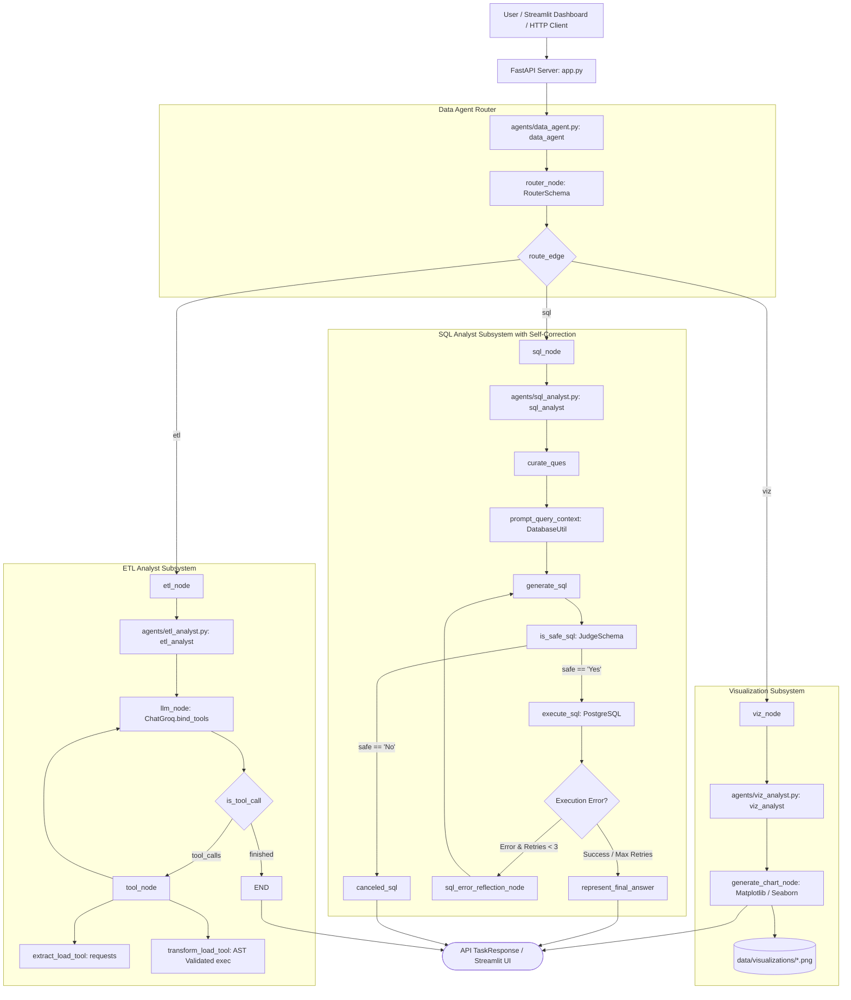

# 00 — Current Project Understanding

This document establishes an evidence-based technical understanding of the **CURRENT state** of the **Agentic AI Data Agent** codebase in `e:/AI_Data_Agent-main`.

---

## 📌 Executive Overview

**Agentic AI Data Agent** is an autonomous multi-agent data engineering, analytics, and visualization platform built with **LangGraph**, **FastAPI**, **Streamlit**, **Pydantic**, **Pandas**, **PostgreSQL**, and **Groq (`ChatGroq`)**.

It processes natural language user prompts by dynamically classifying intent and executing workflows across 4 specialized agent sub-graphs:
1. **Data Agent (Router Graph)**: Directs prompts to `"sql"`, `"etl"`, or `"viz"` sub-graphs based on LLM structured output classification (`RouterSchema`).
2. **SQL Analyst Agent**: A 8-node state machine that curates questions, introspects PostgreSQL table schemas and sample data, generates SQL queries, validates query safety via an LLM judge (`JudgeSchema`), executes safe queries on PostgreSQL, **self-corrects failed SQL queries via a reflection retry loop (up to 3 retries)**, and formats natural language text answers.
3. **ETL Analyst Agent**: A ReAct tool-calling graph using `extract_load_tool` (web API JSON extraction into CSV/JSON/Parquet) and `transform_load_tool` (AST-validated Pandas code execution).
4. **Data Visualization Agent**: A specialized graph (`agents/viz_analyst.py`) that generates Matplotlib/Seaborn Python code and saves PNG charts under `data/visualizations/`.

---

## 🗺️ Current System Architecture Diagram

---

## 🛠️ Complete Inventory of Current Source Files

- **`main.py`**: CLI entry point executing `data_agent.invoke()`.
- **`app.py`**: FastAPI backend service exposing `/api/v1/tasks`, `/api/v1/schema`, and `/health`.
- **`app_ui.py`**: Streamlit web chat UI with database schema inspector, mermaid graph viewer, and benchmark runner.
- **`evals/run_evals.py`**: Automated LLM-as-a-Judge evaluation benchmark harness.
- **`agents/data_agent.py`**: Master Router graph (`router_node`, `sql_node`, `etl_node`, `viz_node`).
- **`agents/sql_analyst.py`**: SQL Analyst graph with reflection self-correction retry loop.
- **`agents/etl_analyst.py`**: ReAct tool agent (`extract_load_tool`, `transform_load_tool`).
- **`agents/viz_analyst.py`**: Data Visualization chart generation agent.
- **`Models/schema.py`**: Pydantic schemas (`AgentSchema`, `JudgeSchema`, `ETLAgentSchema`, `VizAgentSchema`, `RouterSchema`, `DataAgentSchema`).
- **`utils/database.py`**: PostgreSQL connection driver & schema introspection utility (connection closed bug fixed).
- **`utils/etl_tools.py`**: API extractor, dataset preview context, and AST-validated Python code executor.
- **`utils/llm_pick.py`**: LLM provider resolver (`LLM_PROVIDER=groq` with `ChatGroq`).
- **`feed_db.py`**: PostgreSQL DDL creation & CSV bulk data loader.
