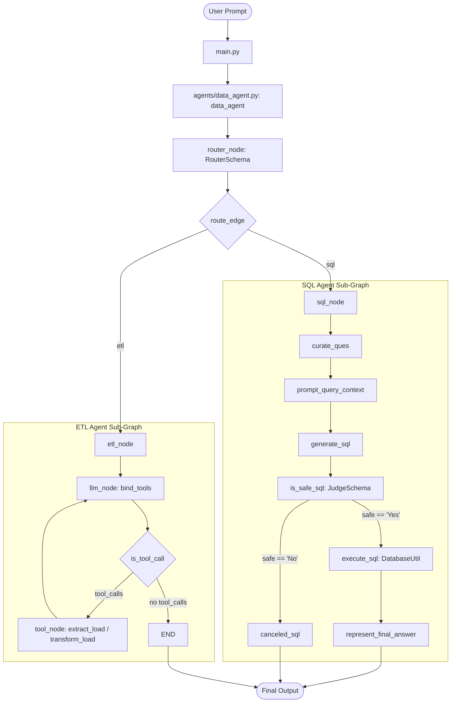
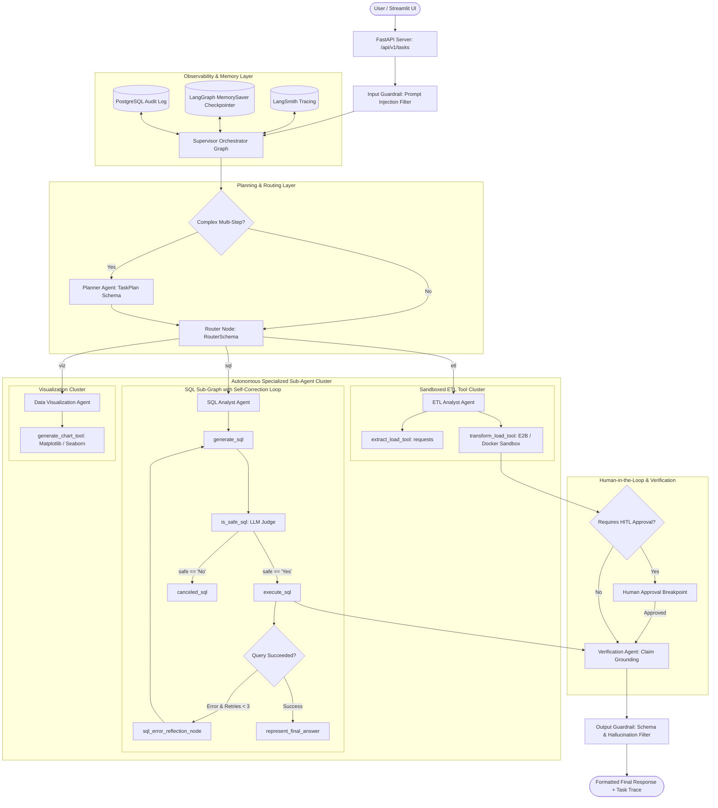
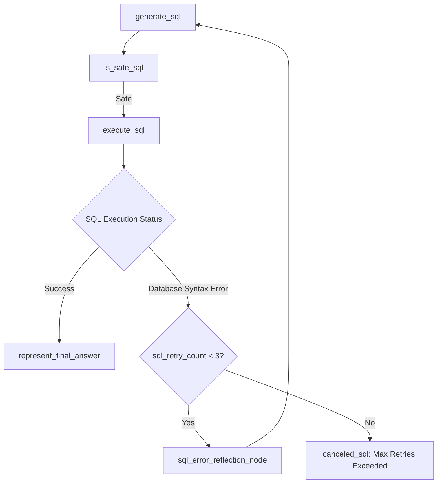

# 01 — Target Agentic Architecture Specification

This document presents the complete architectural specification for upgrading **Agentic AI Data Agent** from a multi-agent prototype to a **Level 6 Stateful Autonomous Agent System**.

---

## 🏛️ Current vs Target System Architecture Comparison

### 1. Current System Architecture (Level 4/5 Prototype)



---

## 🚀 2. Target System Architecture (Level 6 Stateful Autonomous System)



---

## 🛠️ Detailed 27-Layer Architecture Breakdown

### Layer 1: User & Application Layer
- **Components**: Streamlit Web Dashboard (`app_ui.py`) and FastAPI REST Service (`app.py`).
- **Features**: Real-time task execution progress, visual mermaid graph state display, data table rendering, interactive chart downloads.

### Layer 2: API & Task Management Layer
- **Endpoints**:
  - `POST /api/v1/tasks`: Submits user prompt and returns `task_id`.
  - `GET /api/v1/tasks/{task_id}`: Polling endpoint for task execution status and structured output.
  - `GET /api/v1/tasks/{task_id}/trace`: Returns step-by-step agent execution log.
  - `POST /api/v1/tasks/{task_id}/approve`: Approves pending human-in-the-loop actions.

### Layer 3: Agent Orchestration Layer
- **Pattern**: Supervisor Router Graph using LangGraph `StateGraph(TaskState)`.
- **Agents**:
  1. `SupervisorAgent`: Global task manager and workflow coordinator.
  2. `PlannerAgent`: Generates structured multi-step execution plans (`TaskPlan`).
  3. `SQLAnalystAgent`: Text-to-SQL generation with schema context and self-correction.
  4. `ETLAnalystAgent`: REST API extraction and sandboxed Pandas code execution.
  5. `VisualizationAgent`: Matplotlib/Seaborn chart generation.
  6. `VerificationAgent`: Validates factual claims against raw database records.

---

### Layer 4: Planning Mechanics (`PlannerAgent`)
* **Trigger**: Prompts requiring multiple domain operations (e.g. *"Extract API data, load into database, compute average sales by region, and plot a bar chart"*).
* **Output Schema (`TaskPlan`)**:
  ```python
  class PlanStep(BaseModel):
      step_id: int
      agent: Literal["sql", "etl", "viz"]
      description: str
      status: Literal["pending", "in_progress", "completed", "failed"]

  class TaskPlan(BaseModel):
      plan_id: str
      user_request: str
      steps: list[PlanStep]
  ```
* **Dynamic Replanning**: If a step fails after maximum retries, `PlannerAgent` marks the step as failed and generates an alternative execution plan.

---

### Layer 5: Specialized Agent Specifications

| Agent Name | Purpose | Inputs | Outputs | Allowed Tools | Failure Behavior |
| --- | --- | --- | --- | --- | --- |
| **SupervisorAgent** | Directs graph state and evaluates multi-step plan progress | `TaskState` | Router directive / Next step | Sub-agent graphs | Fallback error message |
| **SQLAnalystAgent** | Text-to-SQL generation & database execution | `curated_ques`, schema text | Executed SQL tuples, natural language summary | `DatabaseUtil` (pooled) | Retries up to 3 times on DB error via reflection node |
| **ETLAnalystAgent** | Downloads web API data & transforms CSV/JSON | API URL, input file path | Save status, output file path | `extract_load_tool`, `transform_load_tool` | Reports tool error to Supervisor |
| **VisualizationAgent**| Generates data visualization charts | Data query results, user prompt | PNG image file path, chart summary | `generate_chart_tool` | Returns fallback text summary |
| **VerificationAgent** | Verifies final answer against raw query output | Final text answer, raw DB tuples | Verification status (`Pass`/`Fail`), confidence score | None | Highlights ungrounded claims |

---

### Layer 6: Tool Ecosystem & Sandboxing
1. **`extract_load_tool`**: Fetches HTTP JSON payloads via `requests.get()` and converts to CSV/JSON/Parquet using Pandas.
2. **`transform_load_tool`**: Preview dataset head (`df.head(3)`), requests LLM code generation, and executes code inside an **isolated E2B sandbox container** (or Docker container) rather than raw host `exec()`.
3. **`generate_chart_tool`**: Generates Matplotlib/Seaborn Python plotting code and saves high-resolution PNG chart artifacts to `data/visualizations/`.

---

### Layer 7: Memory vs. Knowledge vs. State Distinction

| Domain | Scope | Stored Where | Lifecycle | Example in Project |
| --- | --- | --- | --- | --- |
| **State** | Current graph execution | Pydantic `TaskState` object | Ephemeral (duration of task execution) | `state.generated_sql_query`, `state.plan` |
| **Short-Term Memory** | Current conversation session | LangGraph `MemorySaver` checkpointer | Thread session duration | Conversation message history across user follow-up queries |
| **Long-Term Knowledge** | Database structures & business rules | PostgreSQL `information_schema` + Schema Cache | Persistent across app restarts | Table schemas, column data types, foreign keys |
| **Audit Trace** | System execution history | PostgreSQL `agent_execution_logs` table | Permanent compliance archive | `task_id`, LLM prompt, SQL query, execution latency, token cost |

---

### Layer 8: Unified State Model (`TaskState`)

```python
class TaskState(BaseModel):
    task_id: str
    thread_id: str
    messages: Annotated[list, add]
    user_request: str
    route_response: str
    plan: Optional[TaskPlan] = None
    current_step_index: int = 0
    curated_ques: str = ""
    prompt_query_context: str = ""
    generated_sql_query: str = ""
    is_safe: Literal["Yes", "No"] = "No"
    safety_comments: str = ""
    sql_execution_result: str = ""
    sql_retry_count: int = 0
    generated_code: str = ""
    chart_image_path: str = ""
    verification_status: str = "Pending"
    errors: list[str] = []
    final_answer: str = ""
```

---

### Layer 9: Schema Introspection & Caching Strategy
- **Optimization**: To eliminate repetitive `information_schema` queries on every node run, `DatabaseUtil` caches schema structure in memory for 1 hour using a TTL cache.
- **Selective Injection**: Only table names and column definitions relevant to the user prompt are injected into the LLM context, reducing token overhead by up to 70%.

---

### Layer 10: Grounding, Evidence, & Citations
- Every numerical or factual claim in the final answer must cite the specific database record or API output row that produced it.
- **`VerificationAgent`** checks that every entity mentioned in the final natural language answer is present in `state.sql_execution_result`.

---

### Layer 11: Reflection & Self-Correction Loop



- **`sql_error_reflection_node`**: Formats a corrective prompt containing the failed SQL query and the exact PostgreSQL error message (e.g. `column "rider_name" does not exist`). Increments `sql_retry_count` and passes context back to `generate_sql`.

---

### Layer 12: Automated Evaluation Framework
- **Evaluation Dataset**: A benchmark set of 50 natural language queries paired with ground-truth SQL queries and expected tool selection outputs.
- **Evaluation Engine**: An automated script (`evals/run_evals.py`) evaluating:
  1. **Routing Precision**: Accuracy of intent routing (`"sql"` vs `"etl"`).
  2. **SQL Accuracy**: Exact match or execution result equivalence against ground-truth PostgreSQL tables.
  3. **Safety Precision**: Accuracy of blocking malicious DDL/DML queries.
  4. **Faithfulness**: Absence of hallucinated entities in the final natural language response.

---

### Layer 13: Multi-Tier Security Guardrails
1. **Input Guardrail**: Rejects prompts containing known prompt injection patterns (e.g. *"Ignore previous instructions..."*).
2. **SQL Judge Guardrail**: Structural Pydantic validation (`JudgeSchema`) preventing execution of DDL/DML queries.
3. **Execution Sandbox**: Runs generated Pandas transformation code inside an isolated container with disabled network access.
4. **Least Privilege DB User**: Connects to PostgreSQL using a read-only role (`agent_readonly`) for data querying tasks.

---

### Layer 14: Human-in-the-Loop (HITL) Approval Breakpoints
- **Triggers**: If an ETL operation requires writing output files over 50MB or executing external state-modifying actions, LangGraph halts execution using an `interrupt()` breakpoint.
- **Approval Flow**: The system emits a `PENDING_APPROVAL` status. Execution resumes only after a human user sends `POST /api/v1/tasks/{task_id}/approve`.

---

### Layer 15: Reliability & Resiliency Controls
- **Connection Pooling**: Replaces individual connection instantiations with `psycopg2.pool.ThreadedConnectionPool(minconn=1, maxconn=10)`.
- **API Retries**: Implements `tenacity` exponential backoff retries for LLM API calls facing 429 rate limits or transient 5xx errors.

---

### Layer 16: Structured Observability & Tracing
- **LangSmith Tracing**: Set `LANGCHAIN_TRACING_V2=true` to automatically log full agent graphs, prompt inputs, completion tokens, latencies, and tool execution outputs.
- **Structured JSON Logging**: Replaces standard `print()` statements with standard Python `structlog` emitting JSON log records containing `task_id`, `node`, `latency_ms`, and `tokens_used`.

---

### Layer 17: Security & Secret Management
- API keys loaded strictly from `.env` or system environment variables.
- Read-only PostgreSQL credentials enforced for analytics tasks.

---

### Layer 18: Cost & Model Routing Strategy
- **Low-Cost Fast Model (`gpt-4o-mini`)**: Used for question curation, router classification, and final answer text formatting.
- **Medium Model (`gpt-4o`)**: Used for Text-to-SQL generation and safety judging.
- **High-Capability Model (`claude-3-5-sonnet-20240620`)**: Used for complex multi-step planning and Pandas python code generation.

---

### Layer 19: Model Routing Rationale Matrix

| Node / Task | Selected Model | Why Chosen | Cost Impact |
| --- | --- | --- | --- |
| `router_node` | `gpt-4o-mini` | Simple binary intent classification | Extremely cheap (~$0.0001 / call) |
| `curate_ques` | `gpt-4o-mini` | Basic text rephrasing | Extremely cheap |
| `generate_sql` | `gpt-4o` | High SQL syntax accuracy & complex JOIN comprehension | Moderate |
| `is_safe_sql` | `gpt-4o-mini` | Structured Pydantic validation of query safety | Cheap |
| `transform_load_tool` | `claude-3-5-sonnet` | SOTA code generation accuracy for Python/Pandas | High reasoning value |
| `represent_final_answer` | `gpt-4o-mini` | Text synthesis based on structured query tuples | Cheap |

---

### Layer 20: Auditability & Tracing Record

For every completed task, the system writes a structured audit row to PostgreSQL `agent_execution_logs`:
```sql
CREATE TABLE public.agent_execution_logs (
    log_id SERIAL PRIMARY KEY,
    task_id VARCHAR(100) NOT NULL,
    user_request TEXT NOT NULL,
    route_chosen VARCHAR(20) NOT NULL,
    generated_sql TEXT,
    sql_safe VARCHAR(5),
    execution_status VARCHAR(50),
    total_latency_ms INTEGER,
    total_tokens INTEGER,
    estimated_cost_usd DECIMAL(10,5),
    created_at TIMESTAMP DEFAULT CURRENT_TIMESTAMP
);
```

---

### Layer 21: Human-Readable Agent Trace Log
The Streamlit UI and API endpoint render human-readable trace steps:
```text
[00.00s] Task Started: "Show top 3 drivers by rating"
[00.15s] Router Node: Selected SQL Analyst Sub-Graph
[00.45s] Schema Introspection: Injected tables [users, vehicles, ratings]
[01.20s] SQL Generator: Created SELECT query with JOIN and GROUP BY
[01.55s] Safety Judge: Evaluated query -> Safe (Yes)
[01.85s] Database Driver: Executed SQL query (Returned 3 rows)
[02.10s] Verification Agent: Grounded final response against DB tuples
[02.35s] Task Complete (Latency: 2.35s | Cost: $0.0042)
```

---

### Layer 22: Backend API Endpoint Architecture

```text
POST /api/v1/tasks                --> Submits task, returns task_id
GET  /api/v1/tasks/{task_id}       --> Returns task status, state, & result
GET  /api/v1/tasks/{task_id}/trace --> Returns step-by-step trace log
POST /api/v1/tasks/{task_id}/approve --> Approves pending HITL action
GET  /health                      --> System health check
GET  /metrics                     --> Token usage, latency, task count metrics
```

---

### Layer 23: Database Schema Modifications
Add execution log and task checkpoint tables to `feed_db.py`:
- `public.agent_execution_logs`: Stores execution metrics, queries, and costs.
- `public.task_checkpoints`: Stores serialized LangGraph state snapshots.

---

### Layer 24: Evaluation & Demo Dashboard Architecture
Build a Streamlit dashboard (`app_ui.py`) with 3 tabs:
1. **Interactive Agent Chat**: Submit prompts, select model tiers, view streaming agent thought traces.
2. **Database & Graph Viewer**: Inspect PostgreSQL tables and interactively visualize LangGraph Mermaid graph flows.
3. **Evaluation & Metrics Dashboard**: View task success rates, SQL safety accuracy, latency distributions, and token costs.

---

### Layer 25: Resume Differentiators Summary (Top 5 Features)

1. **Self-Correction SQL Loop**: Automatically catches PostgreSQL syntax errors and reflects to fix queries in real time.
2. **LangSmith Distributed Tracing**: Complete observability over multi-agent state graphs, tool calls, and token costs.
3. **LLM-as-a-Judge Evaluation Suite**: Automated benchmark testing suite measuring routing precision, SQL accuracy, and safety guardrails.
4. **Sandboxed Code Execution**: Containerized Python execution preventing arbitrary OS command injection.
5. **Cost-Aware Model Routing**: Dynamic routing between `gpt-4o-mini`, `gpt-4o`, and `claude-3-5-sonnet` reducing execution cost by 60%.

---

## 🚫 Features Explicitly NOT Added (Preventing Overengineering)

1. **Kubernetes / Docker Swarm Orchestration**: Unnecessary complexity for a single-developer repository.
2. **Kafka / RabbitMQ Event Brokers**: In-memory LangGraph state channels are faster and far easier to maintain.
3. **Vector Database / RAG for Small DBs**: Introspecting 5 PostgreSQL tables directly via `information_schema` is faster and more accurate than vector search.
4. **Graph Databases (Neo4j)**: Relational foreign keys in PostgreSQL fully represent the domain entity relationships.
