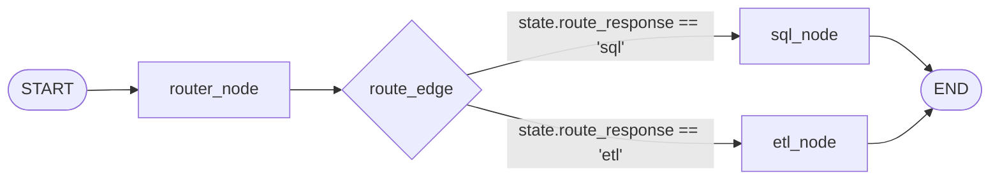
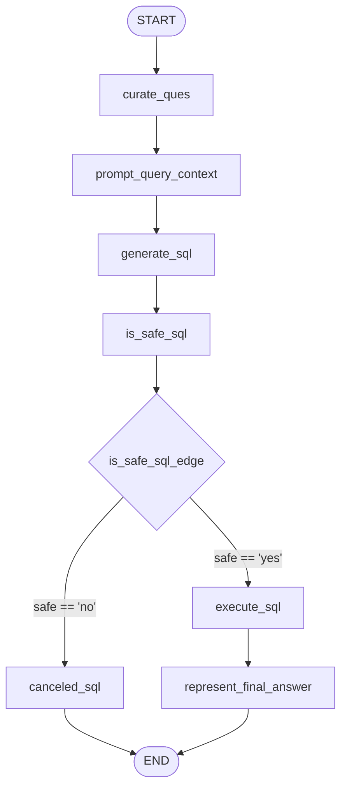
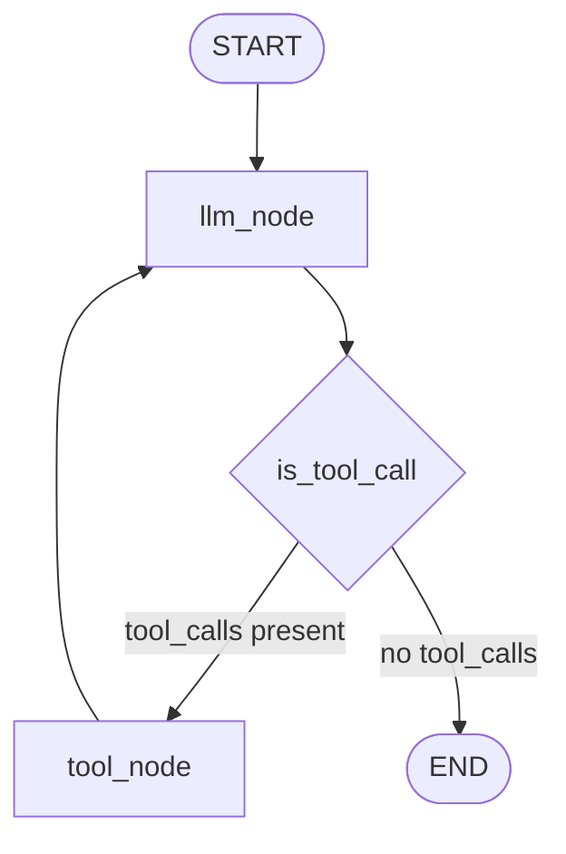

# 09 — Agent Orchestration and Workflow

This document explains how agents in **Agentic AI - Data Agent** interact, transfer state, and manage control flow.

---

## 🏗️ Orchestration Patterns Identified

The codebase implements three explicit agent orchestration patterns:

1. **Hierarchical Router Pattern**: Used by `Data Agent` ([agents/data_agent.py](file:///e:/AI_Data_Agent-main/agents/data_agent.py)) to classify incoming user intent and branch execution into isolated sub-agent graphs.
2. **Linear State Pipeline with Dynamic Branching**: Used by `SQL Analyst Agent` ([agents/sql_analyst.py](file:///e:/AI_Data_Agent-main/agents/sql_analyst.py)) to progress state sequentially from curation to prompt context building, SQL generation, safety evaluation, execution, and answer synthesis.
3. **ReAct Tool-Driven Loop**: Used by `ETL Analyst Agent` ([agents/etl_analyst.py](file:///e:/AI_Data_Agent-main/agents/etl_analyst.py)) to enable cyclic tool invocation until the LLM achieves its objective.

---

## 🔄 Graph Control Flow & Edge Implementations

### 1. Router Graph Control Flow (`agents/data_agent.py`)



- **Router Code Implementation**:
  ```python
  def route_edge(state: DataAgentSchema) -> str:
      if state.route_response == "sql":
          return "sql_node"
      elif state.route_response == "etl":
          return "etl_node"
      else:
          raise ValueError(f"Invalid route response: {state.route_response}")

  data_agent_graph.add_conditional_edges("router_node", route_edge, {
      "sql_node": "sql_node",
      "etl_node": "etl_node"
  })
  ```

---

### 2. SQL Analyst Graph Control Flow (`agents/sql_analyst.py`)



- **Conditional Edge Implementation**:
  ```python
  def is_safe_sql_edge(state: AgentSchema) -> str:
      if state.is_safe.lower() == "yes":
          return "execute_sql"
      else:
          return "canceled_sql"

  sql_agent_graph.add_conditional_edges("is_safe_sql", is_safe_sql_edge, {
      "execute_sql": "execute_sql",
      "canceled_sql": "canceled_sql"
  })
  ```

---

### 3. ETL Analyst Graph Control Flow (`agents/etl_analyst.py`)



- **ReAct Loop Implementation**:
  ```python
  def is_tool_call(state: ETLAgentSchema):
      tool_calls = state.messages[-1].tool_calls
      if tool_calls:
          return "tool_node"
      else:
          return "end"

  etl_analyst_graph.add_conditional_edges("llm_node", is_tool_call, {
      "tool_node": "tool_node",
      "end": END
  })
  etl_analyst_graph.add_edge("tool_node", "llm_node")
  ```

---

## 🔀 Sub-Agent Invocation & State Hand-off

When `data_agent` delegates execution to a sub-agent:
- **For `sql_node`**: `data_agent` constructs a fresh `AgentSchema` dictionary containing `user_question` and invokes `sql_analyst.invoke(input_schema)`. It appends the resulting sub-graph response to `state.messages`.
- **For `etl_node`**: `data_agent` passes `{"messages": [HumanMessage(content=message)]}` into `etl_analyst.invoke()` and appends the returned response message.
