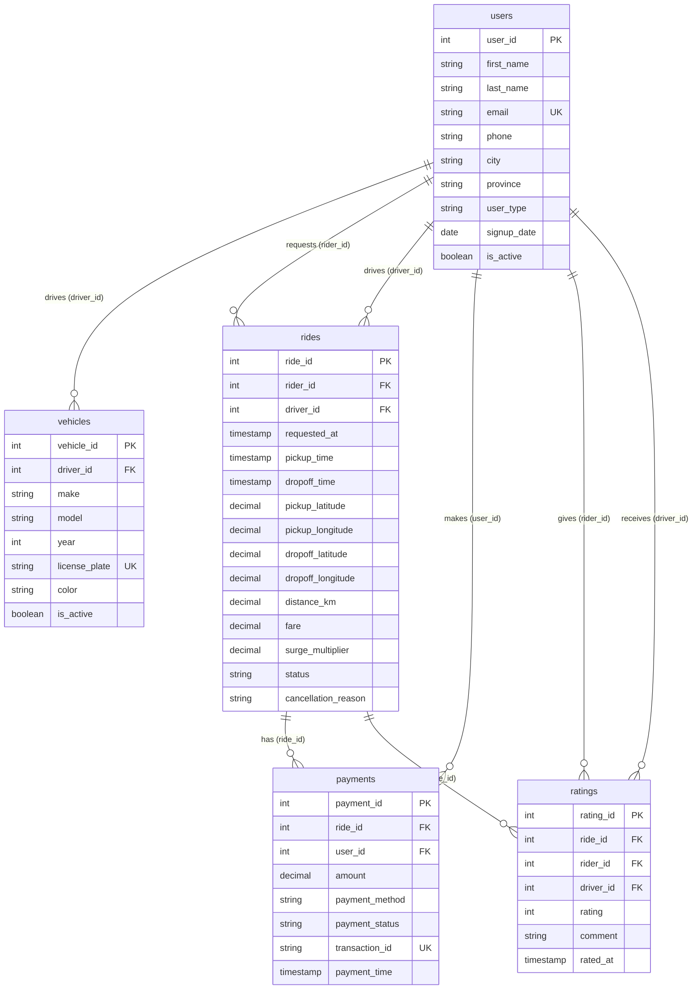

# 13 — Database and Storage

This document provides a complete technical analysis of the PostgreSQL database schema, data models, seeding script, and database access utilities in **Agentic AI - Data Agent**.

---

## 🗄️ Database Technology & Configuration

* **Database Engine**: PostgreSQL
* **Python Driver**: `psycopg2-binary`
* **Configuration Source**: Loaded via `.env` / `os.environ`:
  - `host`: Database host (default: `localhost`)
  - `port`: PostgreSQL port (default: `5432`)
  - `database` / `dbname`: Database name (default: `postgres` or `data_agent_db`)
  - `user`: Database username (default: `postgres`)
  - `password`: Database password

---

## 📊 Relational Entity-Relationship (ER) Diagram



---

## 🛠️ Table Specifications & DDL ([feed_db.py](file:///e:/AI_Data_Agent-main/feed_db.py#L42-L212))

1. **`public.users`**: Stores user profiles (both riders and drivers).
2. **`public.vehicles`**: Stores vehicle records linked to drivers via `driver_id -> users(user_id)`.
3. **`public.rides`**: Stores trip records with foreign keys to rider (`rider_id`) and driver (`driver_id`).
4. **`public.payments`**: Stores trip transactions linked to `ride_id` and `user_id`.
5. **`public.ratings`**: Stores trip ratings (1–5 scale enforced via `CHECK (rating BETWEEN 1 AND 5)`).

---

## ⚡ Database Performance Indexes ([feed_db.py:L185-L211](file:///e:/AI_Data_Agent-main/feed_db.py#L185-L211))
To optimize query performance, the initial DDL script creates explicit indexes on high-frequency query target columns:
- `idx_vehicles_driver_id` on `vehicles(driver_id)`
- `idx_rides_rider_id` on `rides(rider_id)`
- `idx_rides_driver_id` on `rides(driver_id)`
- `idx_rides_requested_at` on `rides(requested_at)`
- `idx_rides_status` on `rides(status)`
- `idx_payments_ride_id` on `payments(ride_id)`
- `idx_payments_user_id` on `payments(user_id)`
- `idx_ratings_ride_id` on `ratings(ride_id)`
- `idx_ratings_driver_id` on `ratings(driver_id)`

---

## 🔌 Database Access Utility: `DatabaseUtil` ([utils/database.py](file:///e:/AI_Data_Agent-main/utils/database.py))

```python
class DatabaseUtil:
    def __init__(self, db_config):
        self.db_config = db_config
        self.connection = psycopg2.connect(**db_config)
```

### Key Methods
1. **`schema_details(schema_name)`**:
   - Queries `information_schema.tables` and `information_schema.columns`.
   - Fetches 5 sample rows using `SELECT * FROM schema.table LIMIT 5`.
   - Returns a structured string injected into prompt context.
2. **`execute_sql(query)`**:
   - Executes SQL query string using a `cursor`.
   - Fetches all rows: `cursor.fetchall()`.
   - Commits transaction: `connection.commit()`.
   - Returns string representation of results.

> [!WARNING]
> **Connection Lifecycle Defect**: In `utils/database.py`, lines 57–58 (`if connection: connection.close()`) close `self.connection` in the `finally` block of `schema_details()` and `execute_sql()`. Subsequent calls on the same `DatabaseUtil` object will raise an exception because the connection was already closed.
