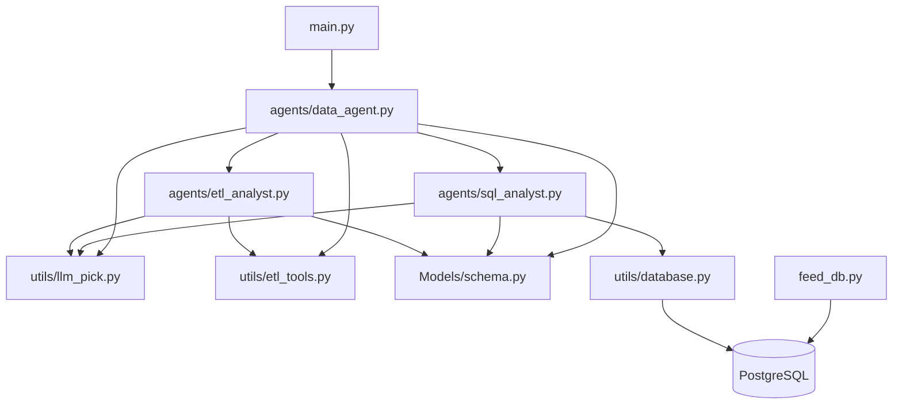

# 20 — Dependency Graph

This document analyzes module coupling, import relationships, and package dependencies across **Agentic AI - Data Agent**.

---

## 🔗 Module Import Hierarchy

---

## 📊 Module Coupling & Cohesion Breakdown

### 1. Central Core Modules (High Fan-In)
- **`Models/schema.py`**: Imported by `agents/data_agent.py`, `agents/sql_analyst.py`, and `agents/etl_analyst.py`. Contains zero outbound project imports. Excellent low-coupling domain data contract module.
- **`utils/llm_pick.py`**: Factory utility imported by all agent graphs to retrieve LLM instances.

### 2. Orchestrator Modules (High Fan-Out)
- **`agents/data_agent.py`**: High coupling. Imports `agents/sql_analyst.py`, `agents/etl_analyst.py`, `utils/llm_pick.py`, `utils/etl_tools.py`, and `Models/schema.py`. Acts as the central hub.

### 3. Leaf Helper Modules
- **`utils/database.py`**: Interacts exclusively with `psycopg2`. No imports of internal agent modules.
- **`utils/etl_tools.py`**: Interacts with standard Python libraries (`requests`, `pandas`, `os`).

---

## 🔄 Circular Dependency Audit
* **Result**: **No Circular Dependencies Detected**.
* Imports flow cleanly unidirectionally from entry points (`main.py`) down through graphs (`agents/`), utilities (`utils/`), and schemas (`Models/`).
