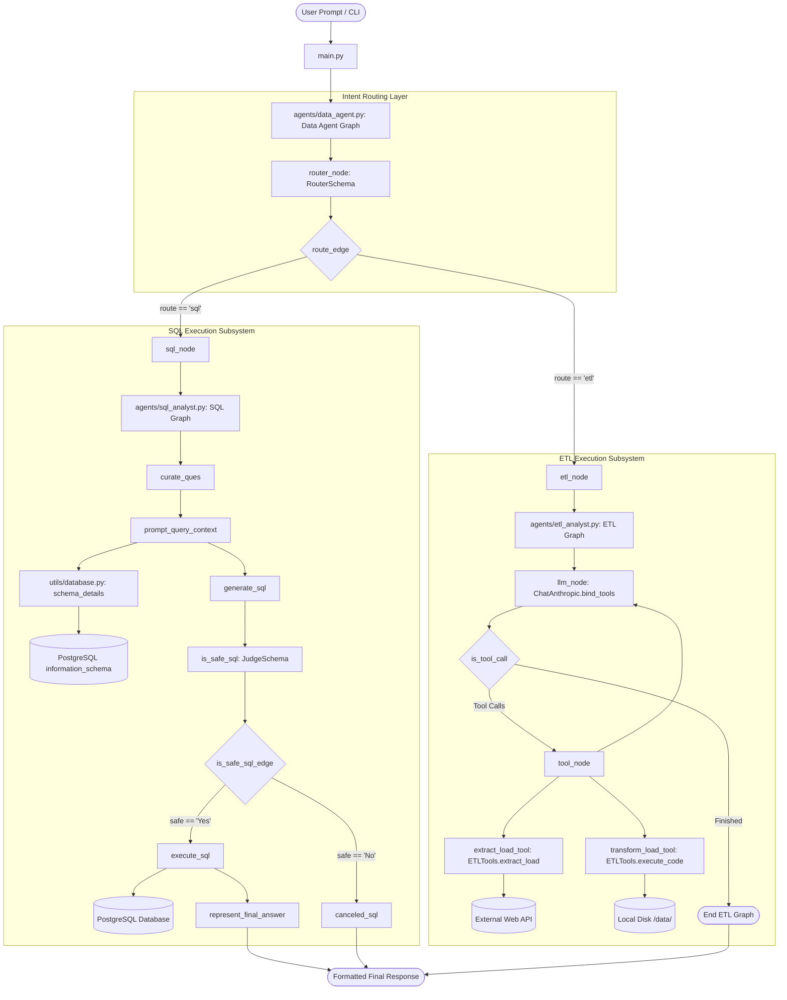
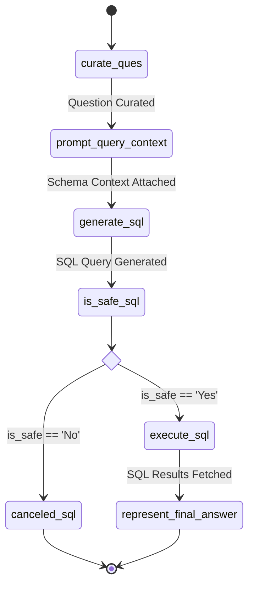
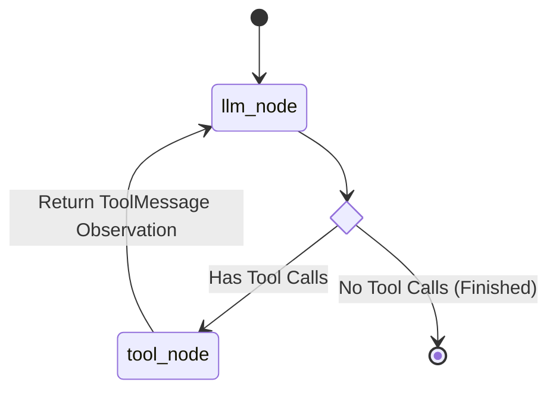

# 23 — Complete Project Diagrams

This document collects essential visual Mermaid diagrams depicting the architecture, graphs, state flows, and data transitions of **Agentic AI - Data Agent**.

---

## 🗺️ 1. Master System Architecture Diagram

---

## 🔄 2. SQL Analyst Sub-Graph Flow

---

## ⚙️ 3. ETL Analyst Sub-Graph Flow

